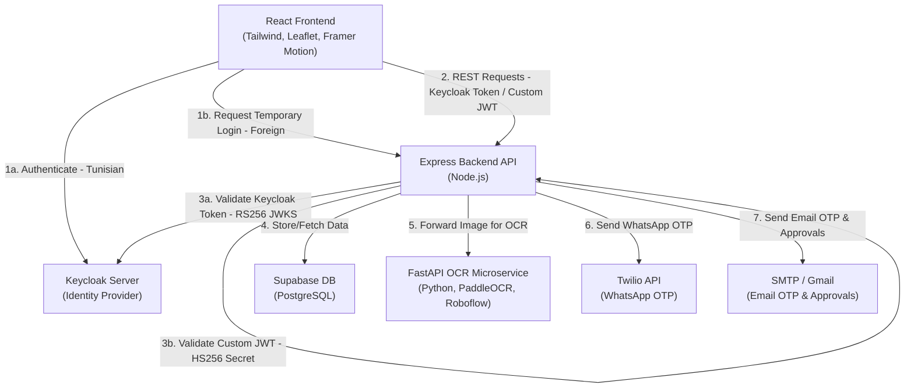

# ⚡ Vehicle Charging Reservation Platform

[](#academic-context)
[](#tech-stack)
[](#authentication--security)

An academic full-stack platform designed to orchestrate electric vehicle charging reservations. The application integrates vehicle identity verification, multi-channel OTP delivery (Email/WhatsApp), OCR-assisted registration document scanning, and separate validation workflows for local (Tunisian) and foreign vehicles.

---

## 🎬 Live Demo

### 1️⃣ Tunisian Vehicle — Full Flow
> Document upload → OCR reads VIN → Email/WhatsApp OTP → Map booking → Confirmed reservation

<!-- Record: Tunisian login flow (~35 sec, 1280x720) -->
<!-- HOW TO UPLOAD: Go to GitHub Issues → New Issue → drag & drop your .gif → copy the URL → replace the placeholder below -->


---

### 2️⃣ Foreign Vehicle — Approval Flow
> Enter matricule + VIN → Back-office receives email → Admin approves → OTP sent → Map booking

<!-- Record: Foreign vehicle + admin approval email (~30 sec, 1280x720) -->


---

### 3️⃣ OCR Document Scan
> Upload registration card → OCR automatically extracts VIN

<!-- Record: OCR scan close-up (~15 sec, 1280x720) -->


---

## 🎓 Academic Context

This project represents the culmination of a **3-month engineering cycle** (covering requirements analysis, conception, interface design, database modeling, and security mapping). 

It was developed under tight constraints, balancing heavy academic responsibilities including parallel courses, homework, exams, and other projects. The primary objective was to deliver a fully functional, end-to-end prototype showcasing modern software engineering practices, system architecture, and complex third-party integrations (Keycloak, Supabase, Twilio, Roboflow).

---

## ⚙️ System Architecture

The platform consists of a React frontend, a Node.js/Express API gateway, and a FastAPI OCR microservice. Below is a high-level diagram illustrating how these components interact:



---

## 🌟 Key Features

*   **Dual Authentication Paths (Dynamic Auth Middleware):**
    *   **Tunisian Registered Vehicles:** Instant verification via License Plate & VIN, contact validation, OTP validation, and Keycloak-based OpenID Connect (OIDC) token authentication (validated via JWKS public keys).
    *   **Foreign Vehicles:** Document upload workflow, back-office email approval link, and temporary OTP-based login issuing custom signed JWT session tokens (validated via local secret key).
*   **OCR-Assisted Document Reading:** Microservice utilizing **PaddleOCR** and **Roboflow Inference SDK** to parse vehicle license plates and chassis numbers (VIN) directly from uploaded documents.
*   **Security & Identity Access Management (IAM):** Managed dynamically using **Keycloak OIDC** token flows for local vehicles and local JWT fallback for foreign ones.
*   **Multi-Channel OTP Delivery:** OTPs generated securely on the backend and transmitted using both **Nodemailer** (Email) and **Twilio** (WhatsApp).
*   **Interactive Station Booking:** Dynamic map interface powered by **Leaflet** to find and book active charging points (*bornes*).
*   **Live Charging Simulator:** Dashboard illustrating real-time charging status, battery health progression, and mock telemetry.

---

## 🛠️ Tech Stack

*   **Frontend:** React, React Router, Tailwind CSS, Framer Motion, Leaflet, Radix UI Primitives, Lucide Icons
*   **Backend API:** Node.js, Express, PostgreSQL (via Supabase), JWT, Nodemailer, Twilio, Multer
*   **OCR Microservice:** Python, FastAPI, PaddleOCR, Roboflow Inference SDK, OpenCV
*   **External Identity Provider:** Keycloak IAM

---

## 🔑 Keycloak Integration & Local Setup

Keycloak is used to manage identity and access flows for registered Tunisian vehicles. Below are the steps and notes for local configuration:

### 1. Starting the Keycloak Dev Server
Run the following commands in your terminal (adjust the path to match your local installation):

```powershell
# Navigate to your Keycloak binary directory
cd /d D:\keycloak-26.6.1\bin

# Start Keycloak in development mode with relaxed security checks for local testing
kc.bat start-dev --hostname-strict=false --http-enabled=true --spi-cors-default-allow-origins="*"
```

*   **Console URL:** [http://localhost:8080/admin/master/console/](http://localhost:8080/admin/master/console/)
*   **Default Admin Username:** `admin`
*   **Default Admin Password:** `admin`

### 2. Testing Authentication Flows
You can obtain tokens manually for validation using the following endpoints:

*   **Get Admin Token (Master Realm):**
    ```bash
    curl -X POST "http://localhost:8080/realms/master/protocol/openid-connect/token" \
      -H "Content-Type: application/x-www-form-urlencoded" \
      -d "grant_type=password&client_id=admin-cli&username=admin&password=admin"
    ```

*   **Get Client Token (Vehicle Realm):**
    ```bash
    curl -X POST "http://localhost:8080/realms/vehicle-app/protocol/openid-connect/token" \
      -H "Content-Type: application/x-www-form-urlencoded" \
      -d "grant_type=password&client_id=vehicle-frontend&username=aa123bb&password=WVWZZZ1KZ4M156743"
    ```

> [!TIP]
> **Important User Creation Note:** When creating new users inside the Keycloak admin panel, make sure to fill out **First Name, Last Name, and Email** fields completely. Leaving any of these fields blank may trigger a "user profile not fully set" error during authentication.

---

## 🚀 Running the Project Locally

### 1. Database Setup
The database schema runs on PostgreSQL (Supabase). For foreign vehicle owners, a text-based national ID starting with `FRG-` is generated automatically. Apply this SQL patch in your Supabase SQL editor:

```sql
CREATE EXTENSION IF NOT EXISTS pgcrypto;

ALTER TABLE owners
ALTER COLUMN national_id SET DEFAULT ('FRG-' || gen_random_uuid()::text);
```

### 2. Configure Environment Variables
Copy the template files in each service directory and populate them with your credentials:

```bash
# Frontend env
copy frontend\.env.example frontend\.env

# Backend env
copy backend\.env.example backend\.env

# OCR Service env
copy ocr_server\.env.example ocr_server\.env
```

### 3. OCR Microservice Setup
Requires Python 3.9+. Create a virtual environment and run the Uvicorn dev server:

```bash
cd ocr_server
python -m venv .venv
.venv\Scripts\activate
pip install -r requirements.txt
uvicorn app.main:app --host 127.0.0.1 --port 8000 --reload
```
*   **Swagger API Docs:** [http://127.0.0.1:8000/docs](http://127.0.0.1:8000/docs)

### 4. Backend Gateway Setup
```bash
cd backend
npm install
npm run dev
```
*   **Backend Server:** [http://localhost:5000](http://localhost:5000)

### 5. Frontend Setup
```bash
cd frontend
npm install
npm start
```
*   **Web Client:** [http://localhost:3000](http://localhost:3000)

---

## 📈 Future Improvements

While the application features robust integrations, the following improvements are planned for production deployment:
- [ ] **Automated Testing:** Implement Jest/React Testing Library for frontend and Supertest for Express routes.
- [ ] **Configuration Isolation:** Consolidate external service URLs entirely into system environment variables.
- [ ] **Admin Console:** Implement a React-based back-office portal to replace the simple email-link approval mechanism for foreign vehicles.
- [ ] **Database Migrations:** Build proper Knex or Prisma migration scripts instead of direct SQL patches.
